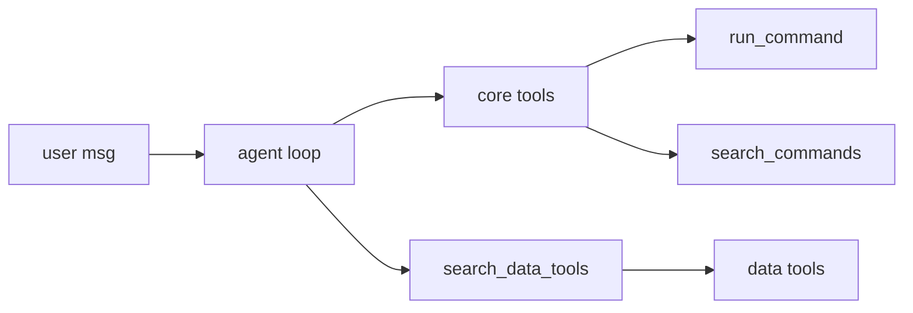

# AI Agent

The AI agent lets users talk to the bot in plain language. It reads messages, picks which commands or data lookups to run, and replies with the result.

Example: a user says "show me my waifu stats and give 100 currency to Alice". The agent finds `.waifuinfo`, runs it, parses the output, runs `.give 100 @Alice`, and posts a summary.

## What's in the box

- `.agent <message>` -- start a turn. The agent decides which tools to call.
- Prompt files on disk (`data/ai/prompts/`) control the bot's personality and operator rules.
- Skills (stored per guild) let server admins add instructions that apply to every turn in that guild, or only in one channel.
- Data tools return JSON for reads (balances, stats, config) so the agent doesn't have to parse embeds.
- `run_command` is how writes happen -- the agent invokes real bot commands through the normal permission pipeline.

## How a turn flows

Core tools are always in the LLM context. Data tools are discovered on demand via `search_data_tools`, so the tool list stays small even with dozens of adapters.

## Who controls what

| Layer | Who edits | Scope |
|---|---|---|
| `SOUL.md`, `OPERATOR.md`, `modules/*.md` | Bot owner | Whole bot process |
| Skills (`AiAgentGuildSkill`) | Server admins | One guild, or one channel in that guild |
| The agent's replies | No one directly | Constrained by the two above + user permissions |

The agent runs as the invoking user. It can't do anything that user can't do through normal commands. Tools that require `ManageMessages`, `Administrator`, or bot-owner status are hidden from users who don't have those perms.

## Terminology

- **SOUL** -- the bot's identity. One markdown file, owner-edited.
- **OPERATOR** -- rules from the owner to the agent (tone, red lines, etc.).
- **Module** -- an optional `.md` file under `modules/`. Toggle on or off globally.
- **Skill** -- guild-level instruction stored in the DB.
- **Channel skill** -- same but scoped to one channel.
- **Data tool** -- a read-only function the agent calls to fetch JSON. Adapters live next to the feature code.
- **Core tool** -- `ask_user`, `send_message`, `run_command`, `search_commands`, `search_data_tools`, `describe_data_tool`, `invoke_data_tool`. Always loaded.

## Next

- [Owner setup](owner-setup.md) -- creds, model config, prompt files.
- [Usage and skills](usage.md) -- `.agent`, skills, channel skills.
